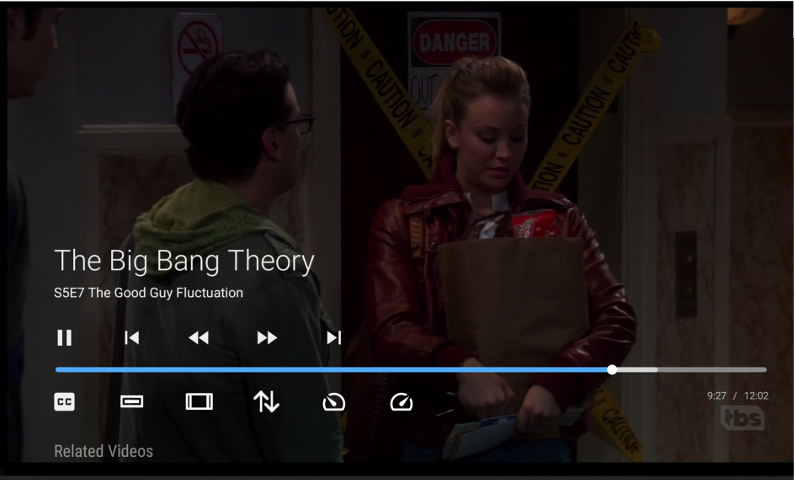

# MythTV leanfront: Android TV frontend for MythTV

This is based on a clone of the sample Videos By Google app, designed to run on an Android TV device (such as the Shield or Amazon Fire Stick). It uses the Leanback Support library which enables you to easily develop beautiful Android TV apps with a user-friendly UI that complies with the UX guidelines of Android TV.

## Features

- 4K video plays at 60fps with full 4K resolution. This is currently not achievable with the android port of mythfrontend.
- The application uses exoplayer, which is the player code used by youtube, Amazon Prime and others. As such it will be able to handle new capabilities that are released on Android TV.
- It plays recordings, videos and Live TV from a MythTV backend. All recordings are presented in a way that is consistent with other leanback applications. The first screen shows a list of recording groups. You can drill down to a list of titles in a recording group.
- This application uses the MythTV Service API to communicate with the backend. It needs no access to the database password, and will work on all versions of mythbackend from v29 onwards. It may work on older versions if the APIs are available on the MythTV backend.
- Voice search within the application is supported, for recordings, videos and programs in the guide.
- With backend on master or recent MythTV v30 or later this frontend will prevent idle shutdown on the backend. On older backends you need to take steps to ensure the backend does not shut down while playback is occurring.
- Bookmarks are supported. Bookmarks can be stored on MythTV or on the local leanback frontend (for recordings or videos). In order to store bookmarks for videos on MythTV you need backend version v32-Pre-658-g48557d32c2 or later or v31.0-73-g7bf1284867 or later. If you have an earlier version that does not support the Video/GetSavedBookmark and Video/SetSavedBookmark methods, the bookmarks for videos will be stored locally on the android device.
- There is a setting option to always store bookmarks locally if you prefer. That way each android device can have its own bookmarks, so that if different people are watching separately and at different places in the recordings, they can keep track of bookmarks separately. 
- The "Watched" flag is set if you get to the end of the recording or video during playback. To ensure it is set, press forward to get to the end before exiting playback.
- There is a delete/undelete option so that you can delete shows after watching. Also there set watched or unwatched and remove bookmark options.
- There is a "Stop Recording" option that stops a recording. This works whether the recording was scheduled or is "Live TV" in progress.
- There is a zoom icon and an aspect icon so that you can expand letterbox recordings and correct wrongly stretched recordings.
- There is an icon to move the enlargement up, down, left or right. If you want to hide a ticker at the bottom, you can enlarge then move up, which will leave the top in place and enlarge downwards so that the ticker is off screen.
- Videos do not currently support deletion.
- Wakeup of master backend is supported via setup.
- Sort order of recordings can be customized.
- Subtitles (Closed captions) are supported. There is a setting to change the size of subtitles.
- At the end of a recording playback, you can advance to the next episode or any episode without returning to the main list.
- You can play in-progress recordings and the application will follow the progress as the recording continues.
- Video playback is exclusively via hardware assisted Mediacodec.
- Audio playback is supported using mediacodec (hardware) or ffmpeg (software). By default it will use mediacodec if it can, and will switch to ffmpeg if there is a media format not supported by mediacodec. There is a setting where you can change this default and force either mediacodec or ffmpeg.
- Audio playback supports digital pass-through for AC3 and other digital formats if they are supported on your sound system. It also supports down-mix to stereo if you do not have a system that supports AC3.
- Selection of alternate audio tracks during playback.
- Playback from slave backends is supported.
- Playing of Live TV is supported.
- Synchronization of TV refresh rate to match frame rate, if selected in setup.
- Display Program Guide, create recording rules, update recording rules.
- The *Master Backend Override* MythTV setting is supported. Playback will be from the master backend even for recordings made on a slave. However the Preview image still uses the slave backend, so it will not show if the slave is down.
- Adjustment of Audio Sync in case a recording has a lip-sync problem.
- Support for touch screen devices is usable, although it is not perfect.
- Metadata lookup when scheduling recordings supports tvmaze and tmdb.

## Tips

### To easily get back to a series you were watching recently:

- Enable recently watched list in settings.
- Enable deleted and watched items in the recent list.
- Disable deleted and watched items in the "related" list.
- In mythfrontend, set the deletion delay for deleted shows to 7 days.

Now, if you watched and deleted an episode yesterday, the deleted episode shows at the front of the recent list. Select that episode from the recent list. Go down in the details screen to the related list. You will see unwatched, undeleted episodes of the series and you can select the next one to play.

In the case of Videos, the related list will show unwatched videos from the same directory. If you have all episodes of a series in one directory, this will make it easy to select the next episode to watch.

### Easily Schedule Recordings

Using the search orb at the top of the page, you can search for a title using voice or keyboard. This will respond with a list of recordings that match as well as a list of matches in the program guide. If you press enter on an item from the program guide, you can create a recording rule to record all episodes, one episode, etc.

## Release Notes

You can see a list of changes in each version by looking at the commit list in github. See https://github.com/bennettpeter/android-MythTV-Leanfront/commits/master .

## Main Screen

- A list of recording groups is displayed on the left with titles in the group in a scrolling row on the right. Next to each icon on the left is a number that represents the number of entries on the right in that row. This is not necessarily the same as the number of recordings because on the main screen there is one entry per series. Select a group and press enter to open the screen with that group's contents. Once a group is open there is one entry per episode.
- The LiveTV group shows recordings already made from Live TV as well as channels available to watch live.
- On the top-level screen only, there is a list of recently viewed items. This can be customized in settings to select how far back it goes or to disable it entirely.
- There is a row for "All" at the top.
- After the recording groups there is a row for "Videos", which shows the MythTV Videos by directory.
- There is a row labeled "Tools" at the bottom. There are various options available there.

### Multiple Updates

In a recording group screen or a video directory screen, you can now perform operations on an entire series or an entire videos directory. Select the header for a series or a video directory and do a "long press" or press the menu button if your remote has one. You will get a menu that lets you mark the entire series as watched or unwatched, delete or undelete it, remove bookmarks, allow rerecord or remove from recently watched list.

This operation is not recursive. If there are subdirectories in a video directory, any operation on the directory will be performed on videos in that directory only.

### Settings

The settings icon on the tools row allows setup of the backend ip address and a number of options for this installation of leanfront.

### Refresh

There is a "Refresh" icon on the tools row to refresh the list of recordings and videos from the backend. The list is also refreshed after using Settings if you change the backend ip address or port number. Refresh only refreshes what is on the current view. On the main screen (the one with the MythTV Icon at the top), it refreshes everything. The refresh does not perform a video rescan at the backend, currently you will have to do it from a normal frontend or run "mythutil \-\-scanvideos" on the backend.

If refresh takes a long time, it is likely caused by lookups on the recordedartwork table. This can be caused by the lack of a database index. This has been fixed in v32-Pre-642-ga0017739a0. If you are running an earlier version you can run the following command to create the index. You can do this on any version of MythTV. If you later upgrade to v32 it will detect if the index has already been created and will not create it again.

To create the index, run the following from a command line:

```
mysql -u <UserName> -p <DatabaseName>
CREATE INDEX recordedartwork_ix1 ON recordedartwork (inetref);
quit
```
UserName and DatabaseName can be found in the file .mythtv/config.xml. You will be prompted for the database password, which can also be found in .mythtv/config.xml.

Creating this index changed the refresh time on my system from 38 seconds to 4 seconds, so it can make a big difference.

### Backend Status

The backend status icon of the tools row shows a page with current backend info.

## Playback

- Pressing Enter, up or down brings up the OSD playback controls. Note if you have enabled up/down jumping then up and down will cause a jump instead.
- Left and right arrow will skip back and forward. Holding down the arrow moves quickly through the video. The number of seconds for forward and back skip are customizable in Settings.
- Up and down arrow can be used for bigger jumps by setting a jump interval in settings. I recommend against using this because it interferes with navigation in the OSD. You can move very quickly through playback by holding down left or right arrow`, so jump is not really needed. Jumping can be disabled by setting blank or 0 in the jump interval in Settings. When jumping with up and down arrows, the arrow buttons are disabled for up/down use in the OSD, and this can cause confusion.
- If you are playing a recording that is in progress of being recorded or a LiveTV channel, the behavior will be as follows. When you start watching, the OSD will show the duration being as much as has been recorded at that time. This duration will remain at that figure as you continue watching. Once you get to that point in the recording, there is a slight pause, then playback continues, with duration shown as "---", which means unknown duration. While in this state, if you press forward or back skip, it will revert to showing the amount recorded to date, and perform the forward or back skip requested. When you eventually get to the end as it was when you did the skip operation, it will revert to duration showing as "---" while playback continues.

### Frame Rate Synchronization.

 If you are playing a video or recording that was recorded at a different frame rate from the default for your android device, motion may appear jerky. Frame Rate Synchronization fixes this by changing the refresh rate of your TV to match the frame rate of the video. Select "Match original frame rate" in the playback settings. With Amazon Fire TV Stick you also need to enable the "Match original frame rate" setting in the Fire TV settings.

### Bookmarks.

Bookmarks in a recording or video can be stored in the android device or in the MythTV backend. In Settings, Playback you can select an option to store them locally. On versions of mythbackend before v32-Pre-658-g48557d32c2 or v31.0-73-g7bf1284867, video bookmarks are always stored locally.

If local bookmarks are not selected:

- Upon playback, if there is a local bookmark, it will be used. This can happen if you changed your local bookmarks setting after having already stored some local bookmarks. When exiting playback the bookmark will be stored on MythTV and the local bookmark erased. This can also happen if you upgrade your mythbackend to a version from v32-Pre-658-g48557d32c2 or from v31.0-73-g7bf1284867, the local video bookmarks will be used but will be cleared and set in MythTV from then on.

## Live TV

In the LiveTV recording group are rows showing your TV channels, in groups of 100. If you navigate to a channel and press enter you will see a details page with the channel name and icon. There is a single button, "Play Live TV". Pressing this will set up a recording of that channel, and once the recording is available it will start playing it. There is a difference between this and mythfrontend Live TV. In leanfront, the LiveTV recording will be named "LiveTV" with the date. The recording time and channel will be shown as the subtitle. The recording length defaults to 60 minutes. This default can be changed in Settings. When you exit from playback by any method, the recording is stopped and the recording rule is deleted.

Notes:

- When starting Live TV playback, there is a delay of approximately 15 seconds while the channel is tuned and the recording is started. You will see a circling progress bar during this time.
- Live TV recordings are named only with date, time and channel, unlike in mythfrontend where they are named with the actual program name from the guide.
- Live TV recording rules are created with priority -99. This means they will not preempt any recordings you may have set up for the same time slot.
- Live TV recordings made with leanfront will not honor the tuner LiveTV assignments in setup. They will use the tuners set up for recordings.
- If you invoke Live TV when there is no tuner available or the channel cannot be recorded, there will be a message, after a delay of around 15 seconds, informing you that the recording failed. The message cannot distinguish why the recording failed.
- You can set a default time for LiveTV in Settings. That is the maximum time you can watch. After that time the recording ends. You can exit from the recording and select to play LiveTV again for another period.
- If you set the Live TV recording time too short you will have to keep restarting LiveTV. If you set it too long, your request may fail if there is another recording scheduled during that time and that causes a conflict.
- If you have playback problems that you have to fix with ffmpeg or mkvmerge (see section "Problems" below), then this LiveTV feature will not work for you.
- LiveTV recordings are kept for the number of days specified in mythfrontend Setup->Video->General->Auto-Expire->Live TV Max Age
- If you exit LiveTV by disconnecting the android TV device, or the device crashes, the cancel of the recording will not happen and it will continue to record the channel. You can reconnect the android device, go into the LiveTV group and find the recording there. If it is still recording you can use the "Stop Recording" option from the "Other Actions" button. If you want to watch it you can do so from there.
- While watching Live TV, if the backend goes down and comes up again, it will resume the recording. You can go into the LiveTV group and stop it, or you can watch it from the LiveTV group.


## Manage recordings

An icon in the Tools row brings up a section where you can view the program guide, and setup and modify recording rules.

Also, you can use the search icon from any page to search on show titles. You can create a record rule on any title that is found in the Program Guide.

### Program Guide Page

In the program guide
 
- Select a new date and time for the guide: Press enter on any of the cells that show the time.
- Move to a new channel number more quickly than using down arrow: Press Enter on any of the cells that show the channel number. Type the desired channel number on the onscreen keyboard. Press Enter.
- Move to the next or prior time slot of guide data: Press enter on any of the arrow cells.
- Schedule a recording or modify the recording: Press enter on any cell that lists a program.

### Recording Rules Page

All recording rules are listed. Press enter on any rule to modify it.

### Upcoming Recordings Page

All upcoming recordings are listed. Press enter on any cell to modify it.

### Rule adding or updating

The page that updates recording rules is similar to the corresponding pages in mythfrontend. The feature "New Episodes Only" is disabled unless you have a recent build of mythbackend. There is a bug in older versions of mythbackend that prevents this from working.

### TV or Movie Metadata

When adding or updating recording rules, the metadata section includes a search to find the correct movie or series id.

There are two options for TV shows, The Movie Database and tvmaze. For movies there is only one option, The Movie Database.

If the show that has been selected has a different name from what is shown in the schedule, you can search on this different name, by changing the search phrase. For example, PBS shows are often called "xxxx on Masterpiece", for example "Poldark on Masterpiece". In this case, searching tvmaze or tmdb for "Poldark on Masterpiece" finds nothing, but by changing the search phrase to "Poldark", you can find the series details.

 You can use tvmaze or The Movie Database, as long as you have a recent backend that supports the option. If your show is not found on one service, you can try the other. This does not depend on the default lookup method selected in mythfrontend. In mythfrontend you can select the movie database or tvmaze as the default. Even if you have selected one as the default, you can still use the other for specific record rules.

## Search

The Search orb at the top of each page allows searching the recordings, videos and program guide. You can do voice search or type using the onscreen keyboard. In the video search results you can play the found recording or video. In the guide search results you can press enter to schedule or modify recordings. Note that to use voice search on Amazon Fire Stick you have to right arrow into the text entry field, then press the microphone button. Otherwise pressing the microphone button searches Amazon instead.

## Problems

In earlier versions of leanfront, some recordings or videos may not play correctly, or may not play at all. In some cases,
videos may play but the duration may not show in the OSD and skipping forward may not work.
These problems have been fixed as far as I know. Please let me know if you experience this.

In videos that have been cut or processed using mythtranscode, audio may be garbled.
If the recording plays correctly with mythfrontend or VLC but not with leanfront,
try running one of these commands (below) against the file. Use the first one for recorded programs only (mpeg ts streams).
The second command can be used for recordings or videos. The second command converts the file to
mkv format. You do not need to use an mkv extension, a ts or mpg extension will also work for an mkv format
file.

```
ffmpeg -i inputfile -acodec copy -vcodec copy -scodec copy -f mpegts outputfile
mkvmerge -o outputfile inputfile
```
You can overwrite the recording or video file with the output from one of these commands. Both of these commands run very quickly and recreate the file with any inconsistencies fixed. The mkvmerge command seems to be better than ffmpeg at fixing most problems.

You can create a user job to run one of these commands after each recording if necessary.

### Error handling

Playback errors sometimes occur, often when skipping forward, but also at other times. The program will try to recover from the error. If you select in settings "Playback -> Show Playback Error Toast" it will display a brief message that there was an error. If errors continue, it will show a dialog box where you can choose to continue or exit. The "continue" option will attempt to bypass the error. This may not always succeed. Playback errors are logged, and you can see the log messages using the procedure in "Debugging" below.

### Debugging

There are a few log messages generated by the program. To see the program specific log messages run these commands:

```
adb connect <ip address>
adb logcat lfe:D *:S
```
If the program crashes, the above command may not show anything useful. To get the full system log, including crash reports, run these commands:

```
adb connect <ip address>
adb logcat
```

## Playback controls (OSD)



The following controls are available when pressing enter during playback. Select an icon and press enter to apply it. The name of the currently selected icon is displayed below the progress bar.

### Top Row of Controls

| Icon | Usage |
|------|-------|
| Play/Pause | Switches between pause icon and play icon depending on the current state. |
| Skip Previous | This plays, from the beginning, the previous recording or video in the list without needing to exit from playback (see related videos, below). |
| Rewind | This skips back by the time set in the settings. |
| Jump Forward | This skips forward by the time set in the settings. |
| Skip Next | This plays, from the beginning, the next recording or video in the list without needing to exit from playback (see related videos, below). |
| Change Playback Speed | Speeds up or slow down playback by increments to a maximum of 800%. Shows a seekbar where any desired speed can be selected in increments of 10% |

**Note:** When using *Change Playback Speed* the program will disable digital audio pass-through if it is in use, by temporarily selecting *FFmpeg* audio decode. This will disable surround sound until you exit playback.

### Progress Bar

This shows playback position plus time played and total time. While this is focused you can use left and right arrows to skip back and forward. Holding the arrow down moves quickly through the recording. While this is focused, pressing Enter pauses and resumes.
Below the progress bar is displayed the description of the currently selected icon, if one is selected.

### Bottom Row of controls

| Icon | Usage |
|------|-------|
| Closed Captions | Turns on or off captions (subtitles). If there are multiple languages this rotates among them. |
| Picture Size | Changes the picture size. Pressing this shows a seekbar. Left and right arrow fine tune the size. Up and down arrow select from several standard zoom amounts. |
| Stretch Horizontally | Stretch or squeeze the picture in case it is showing at the wrong aspect ratio.  Pressing this shows a seekbar. Left and right arrow fine tune the stretch. Up and down arrow select from several standard stretch amounts. |
| Move Picture | If the picture has been resized, moves the picture up or down, left or right. Use up, down, left, right arrows to move it. For use when you want to cut off part of the picture, after zooming to a bigger size. |
| Change Audio Track | Rotates among available audio tracks including audio disabled. |
| Adjust Audio Sync | Shows a seekbar where you can change audio sync. Use this if lip sync is wrong. The value selected applies only to this playback, it is not saved after playback is ended. |
| Play Related Videos | Toggle automatic playback of all videos in the related videos list. When activated this displays in green color. At the end of each video or recording it will automatically start the next one. It will play watched or deleted items if you selected them in settings to be included in the related videos list. |

### Related videos

To see Related videos press down arrow. This shows other videos / recordings in the current group. You can select one of these to play from the beginning instead of the current playing video.

## Remote Control

The Fire Stick and NVidia Shield have rather limited remote controls, however there are ways of connecting more advanced remotes, and a TV remote can be used to control the Android TV device using CEC. MythTV leanfront supports many media control keys that could be available.

| Key | Context | Usage |
|-----|---------|-------|
| Back | Playback | If OSD is showing, close OSD. Otherwise Stop Playback and save bookmark |
| Captions | Playback | Rotates among available captions (same as CC icon) |
| DPad Left | Playback | Skip back number of seconds specified in settings (default is 20) |
| DPad Right | Playback | Skip forward number of seconds specified in settings (default is 60) |
| DPad Up | Playback | Show OSD and navigate in OSD |
| DPad Down | Playback | Show OSD and navigate in OSD |
| DPad Center | Playback | Show OSD |
| Media Audio Track | Playback | Rotate among available audio tracks (same as Ear icon) |
| Media Pause | Playback | Pause playback |
| Media Play | Playback | Resume playback if paused |
| Media Play Pause | Playback | Toggle playback between playing and paused |
| Media Fast Forward | Playback | Skip forward number of seconds specified in settings (default is 60) |
| Media Rewind | Playback | Skip back number of seconds specified in settings (default is 20) |
| Media Skip Forward | Playback | Jump forward number of minutes specified in settings (default is 5) |
| Media Skip Backward | Playback | Jump back number of minutes specified in settings (default is 5) |
| Media Stop | Playback | Stop Playback and save bookmark |
| Media Next | Playback | Skip to beginning of the next Video (same as Next Track Icon) |
| Media Previous | Playback | Skip to beginning of the previous Video (same as Previous Track Icon) |
| TV Zoom Mode | Playback | Squeeze or Stretch the picture (same as Stretch Horizontally Icon) |
| Zoom In | Playback | Reduce the picture size (same as Picture Size Icon). |
| Zoom Out | Playback | Increase the picture size (same as Picture Size Icon) |
| Media Play | List | Play selected video from bookmark or beginning without first displaying details page |
| Media Play Pause | List | Play selected video from bookmark or beginning without first displaying details page |
| Media Play | Details Page | Play video from bookmark or beginning |
| Media Play Pause | Details Page | Play video from bookmark or beginning |

If "Use Up/Down Arrows for Jump" is selected in settings, the following apply. However, this may make navigating the OSD more difficult.

| Key | Context | Usage |
|-----|---------|-------|
| DPad Up | Playback | Jump forward number of minutes specified in settings (default is 5) |
| DPad Down | Playback | Jump back number of minutes specified in settings (default is 5) |

## Android Phones / Tablets with touch screen

You can install leanfront on a phone or tablet if you are running Android 5.0 (Lollipop) or later version. The application is designed for Android TV and using it with a touch screen is not the same as other touch screen applications.

There are some problems. Program lists do not work as expected, see below. Leanfront uses landscape mode, and if you rotate it, the display will remain landscape. See below for more differences when operating a touch screen.

### Program List

- Before trying to scroll the program list (right hand side), first scroll the group list (left hand side) to the required row. Scrolling the program list first results in the program list jumping back to the beginning.
- At the required row, press the row name, which will bring the program list for that row into view.
- You can scroll the selected row to get to the show you want. If you fling the row fast to scroll to a later item, it does not move as fast as it appears, even after a long fling you may end up just a few items further in the list. Scrolling slower works better.

### Details page

On a phone the Play and other action buttons may be too big and may not all display. To see buttons that are off screen, drag with your finger. 

### Playback

- Playback controls (On Screen Display) can be accessed by tapping in the playback area, but not top corners. You can tap any of the playback controls to invoke them. The "Move Picture" control currently does not work as it needs arrow key presses. Seekbar controls can be operated by sliding your finger along the bar to select required size, speed or stretch.
- Hide the playback controls by double tapping in the playback.
- Skip forward and skip back are difficult to use with the playback controls on a touch screen, as the playback controls disappear soon after a skip. There is an alternative for touch screens. Tap the top right corner or top left corner to skip forward or back. Press and hold for repeat-action to skip repeatedly until you reach the required position.
- In playback, leanfront operates full screen. To exit, you need the back button. Swipe from the top or bottom of the screen to see the system buttons. Press back before it disappears again. Note that to stop playback while the playback controls are showing, you have to press back twice, once to close the playback controls, and again to close playback, or else double tap to close playback controls and back to close playback.
- You cannot get to the "Related Videos" during playback. However you can see them on the details page before starting or after ending playback.

## Leanfront Restrictions / Limitations

These may be addressed in a future release.

- Moving recordings to new recording groups is not supported.
- Metadata input and update are not supported.
- Request of video file scan is not supported.

## Download and install

Note: Bintray is being taken down in May 2021, so I am switching to another site for package downloads.

- Download the latest apk from [downloads].
- Enable developer mode on your android device.
- install adb on your computer
- Run these

```
    adb connect <android-ip-address>
    adb install -r <apk-name>
```
Alternatively, if you have a browser on your android device you can avoid using developer mode.

- Enable installation of apps from unknown source in Android settings.
- Navigate to the download site (https://dl.orangedox.com/pCBmBm), find the latest version, tap it and request the system to install it.

## Install on Laptop or Desktop

The quality of video and audio playback is not good on the emulator. However, if you want to use the scheduling options that are available on leanfront, such as scheduling and metadata lookup, that can easily be done on a PC from the emulator.

The release package is built for arm 32 bit and 64 bit devices. The debug version is built for those plus x86 and amd64 devices. You can install [Android Studio][studio], then install an android emulator and run the debug package on the emulator. Note that the emulator plays h264 (AVC) and h265 (HEVC) video. It does not play MPEG2.

After installing [Android Studio][studio], use SDK Manager to install the emulator and sdk tools. You do not need to install an SDK if you are not doing development. Then run the AVD manager to create an android TV device with recent version. Do not specify quick startup (the default) in AVD setup of the emulator. Select "Cold Boot" in advanced settings for the emulator. From AVD manager you can start the virtual device, then use adb to install the apk file as you would with a real android device. Note that with the emulator you do not need to connect adb to the device, it is automatically connected when you start the emulator. Don't forget to set time zone in the emulator settings. After setting it up, you can subsequently start up the emulator from a command line or script that runs this:

```
    $HOME/Android/Sdk/emulator/emulator -avd <virtual device name>
```

## To Do List

Possible additions.

Further development will continue. These are some possible additions.

- Allow search from android home screen.
- Allow recommendations from android home screen.
- Amazon specific search and recommendations.

The following items will need api changes on the backend

- Video scan
- Video delete
- Change recording group on a recording.

## Building

- Download and install [Android Studio][studio]. Also download the latest ndk and Cmake from within android studio. Look in the "Build" tab for a message about this. If you encounter this, switch to the requested NDK version.
- Note the ndk version is referenced in the app/build.gradle file. You need to either download the version that is specified there or else update there to match the version you downloaded.
- In the $HOME/Android directory create a link to the ndk, for example android-ndk -> Sdk/ndk/20.0.5594570
- In the app/src/main/jni/ directory, run download_ffmpeg.sh and build_ffmpeg.sh.
- Open the project in [Android Studio][studio].
- Compile and deploy to your Android TV device (such as a Shield or Amazon fire stick). 
- It can also be run with an android emulator, but the emulator that comes with android studio does not support MPEG2 playback, so you need to play an h264 or h265 recording.
- If you do not want to build this yourself, there is a package at [downloads].

## Running

Start up the app. There is an entry on the main screen at the end called "settings". There you need to enter the backend ip address. There are other options available here.

If using backend earlier than fixes/30 of Nov 12 2019 or Master of October 31 2019, make sure the backend is not set up for automatic shutdown when inactive. Otherwise it may shut down during playback.

## Internationalization

The source code will support multiple languages. Currently only the default language, English, is included. If anybody reading this is fluent in another language and would like volunteer to translate the strings and messages, please contact me. To get an idea of the amount of work, the list of strings is at https://github.com/bennettpeter/android-MythTV-Leanfront/blob/master/app/src/main/res/values/strings.xml . These would need to be translated, except for the ones marked translatable="false". You can email me or create an issue from https://github.com/bennettpeter/android-MythTV-Leanfront/issues . I will put together instructions on how to update the translations.

## License

Licensed under the GNU GPL version 3 or later. See the [LICENSE file][license] for details.

[studio]: https://developer.android.com/tools/studio/index.html
[license]: LICENSE
[bintray]: https://dl.bintray.com/bennettpeter/generic/mythtv_leanfront/android
[downloads]: https://dl.orangedox.com/pCBmBm